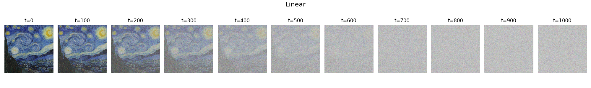
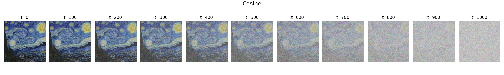

Noise an image in steps according to linear or cosine schedule. 

Plot of all resulting images is made plus single images are saved. 

Usage:
py noise_image.py --image_path van_gogh.png --output_folder cosine_noised_images --schedule cosine --T 1001 --save_every_n_steps 100 --center_crop 899

